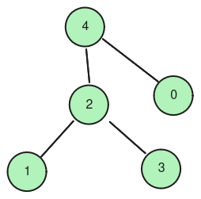

# Exercício de Grafos

Nesse exercício, o seu objetivo é receber uma sequência de arestas, modelar o grafo como uma **matriz de adjacência**, e imprimir a vizinhança para cada nó.


O programa receberá uma entrada da seguinte forma:

```
n_vertices n_arestas
no1 no2
no3 no4
...
```

Onde `(no1, no2)` são uma aresta do grafo. Por exemplo, o grafo representado a seguir pode ser descrito da seguinte forma:



```
5 4
4 0
1 2
2 3
4 2
```


**Note que o grafo será sempre considerado como não-direcionado.**


[Clique aqui](grafo.zip) para baixar as entradas e saídas de alguns casos de teste. Ele também tem um programa em python que gera mais casos de teste.


## Como fazer

Para resolver o problema, você terá que alocar uma matriz de tamanho n por n, sendo "n" o número de vértices presente na primeira linha da entrada. Essa matriz deve conter inicialmente apenas zeros. Se você alocar utilizando [calloc](https://www.tutorialspoint.com/c_standard_library/c_function_calloc.htm) ao invés do malloc, sua matriz já será settada toda pra zero.


Lembre-se que para criar uma matriz em C, você precisará criar um "Array de Arrays", onde primeiro você precisará alocar o primeiro array de tamanho n,  e depois iterar por cada posição desse array para alocar outros arrays, também de tamanho n.


Depois disso você terá que ler m linhas ("m" sendo o número de arestas, também na primeira linha), e para cada uma dessas linhas você receberá uma tupla de índices. Para cada par de índices (i, j), você deve settar a sua matriz nas posições `A[i][j]` e `A[j][i]` como iguais a 1. Feito isso para todos os pares, sua matriz de adjacência estará completa.

### Parte 2: imprimir

Para imprimir uma lista de todos os vizinhos de cada vértice, você precisará iterar pelas linhas da sua matriz. Para cada linha (cujo índice será i), você precisará imprimir esse índice, e depois iterar pela linha em si, guardando o índice (j) das posições. Caso o valor em (i, j) seja 1, imprima j. Caso contrário, apenas continue.

No final, cada linha deve estar no seguinte formato, tomando como exemplo um vértice 1, com vizinhos 2, 5, 9.

```
1: 2 5 9
```

